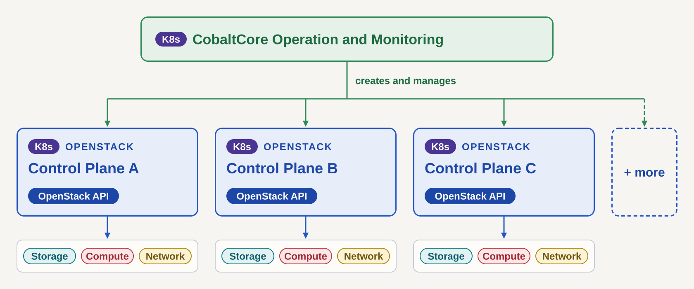
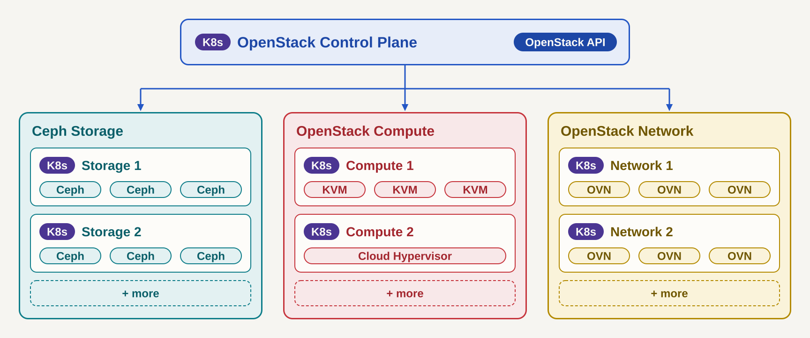

# Architecture

CobaltCore (C5C3) is a Kubernetes-native OpenStack distribution for operating
Hosted Control Planes. Its design originates in the
[C5C3 architecture document](https://c5c3.github.io/C5C3/), an early-concept
sketch of the full multi-cluster system. This page describes the architecture
as this repository implements it, and the implementation is authoritative
where the two differ. Building blocks from the original document that have no
implementation yet are collected as sketches in the [Future](../future/)
section.

The component-by-component catalog, with CRDs and API groups, is on
[Core Components](./core-components.md).

## Implemented topology

Everything runs on one management cluster. FluxCD applies the declarative
infrastructure stack, the operators come up in dependency order, and a single
`ControlPlane` resource then drives a complete OpenStack control plane.
Service workloads either stay on the management cluster or land on registered
target clusters.

![The management cluster: GitOps (flux-operator, FluxInstance) and Secrets & PKI (cert-manager, OpenBao, External Secrets Operator) next to the c5c3-operator, whose ControlPlane CR creates infrastructure CRs, service CRs, and K-ORC resources. One service operator per service (keystone, horizon, glance, placement, barbican, neutron, cinder, nova, ovn) runs the OpenStack services, exposed via the Gateway API. The infrastructure (MariaDB Galera, Memcached, opt-in RabbitMQ, Garage S3) is managed by its own operators. Optional target clusters, registered via kubeconfig Secrets, receive projected service workloads.](../diagrams/cobaltcore-management-cluster.svg)

## Layering

The stack is built in three declarative layers.

**Infrastructure manifests** (`deploy/flux-system/`). A `FluxInstance` syncs
the repository, and HelmReleases install cert-manager, the External Secrets
Operator, OpenBao, and the infrastructure and service operators along an
explicit `dependsOn` graph; K-ORC and the RabbitMQ Cluster Operator are
applied by Flux `Kustomization`s of their own. The full stack, its namespaces,
and the dependency order are documented in
[Infrastructure Manifests](../reference/infrastructure/infrastructure-manifests.md).

**Service operators** (`operators/`). One operator per OpenStack service, each
projecting the service's Deployments, Jobs, configuration, and Secrets from
its CR. The [Keystone operator](../reference/keystone/) is the reference
implementation that sets the patterns — CRD layout, sub-reconciler chain,
webhooks, finalizers, instrumentation — and Horizon, Glance, Placement,
Barbican, Neutron, Cinder, and Nova are onboarded on the same scaffolding
([Adding a New Operator](../contributing/adding-a-new-operator.md)). The
[OVN operator](../reference/ovn/) is the exception to the
one-operator-per-service rule: it runs no OpenStack service of its own, only
the OVN and Open vSwitch layer that the Neutron ML2/OVN driver programs.

**Orchestration** (`operators/c5c3/`). The c5c3-operator turns one
`ControlPlane` CR into a running control plane: it creates the MariaDB,
Memcached, and RabbitMQ CRs, projects the service CRs, mints the admin
application credential through K-ORC, stewards the service-catalog entries,
and aggregates readiness into the `ControlPlane` status. The OVN control plane
stays outside it: the network service names an existing `OVNCentral`, which
the c5c3-operator reads but never creates. Nova is projected through
`services.nova`; the compute nodes that join it are the follow-on
[#1013](https://github.com/C5C3/cobaltcore/issues/1013). See
[ControlPlane Reconciler Architecture](../reference/c5c3/controlplane-reconciler.md).

## Secret flow

OpenBao is the source of truth for credentials, and ESO moves them in both
directions: `ExternalSecret` resources deliver admin and database credentials
to the services, `PushSecret` resources write operator-generated secrets back
to OpenBao. Every ControlPlane reaches OpenBao through a tenant store of its
own, which the c5c3-operator provisions in the ControlPlane namespace. A shared
cluster store serves standalone service CRs. The credentials of a
ControlPlane's managed database are by default issued per lease by OpenBao's
database engine. The bootstrap sequence and the credential chain are
documented in
[OpenBao Bootstrap](../reference/infrastructure/openbao-bootstrap.md) and
[Infrastructure Manifests](../reference/infrastructure/infrastructure-manifests.md#admin-credential-chain).

The figure shows the three paths and the store each one uses.

![Secret flow on the management cluster. OpenBao in shared-services holds a KV engine and a database engine, and the External Secrets Operator moves three kinds of secret. Read: an ExternalSecret copies a value from the KV engine through a secret store into a Secret that pods and Jobs consume. Write-back: a PushSecret copies a Secret an operator wrote through the store into the KV engine. Dynamic: a VaultDynamicSecret generator draws a short-lived MariaDB user from the database engine with a login of its own and no store. A ControlPlane namespace uses the SecretStore openbao-tenant-store, which the c5c3-operator creates and which logs in with the role eso-tenant. The ClusterSecretStore openbao-cluster-store, with the role eso-management, serves standalone service CRs in the openstack namespace.](../diagrams/secrets-flow.svg)

## Service exposure

Service CRs opt into external exposure through the Gateway API: when
`spec.gateway` is set, the operator renders an `HTTPRoute` for the configured
public endpoint. The kind overlay installs Envoy Gateway as the demo
implementation; production overlays do not ship a Gateway controller, and
platform owners bring their own implementation.

The figure follows a request on the kind devstack. What `spec.gateway`
configures is the part inside the cluster, from the Gateway to the pods, and
the port mapping in front of it exists on kind only.
[The request path, hop by hop](../quick-start-extended.md#request-path) names
each hop.

![The path of a request from the workstation to an OpenStack API on the kind devstack, in six numbered hops. Hop 1: the public nip.io service resolves {svc}.127-0-0-1.nip.io to 127.0.0.1. Hop 2: the client connects to 127.0.0.1 on the host port, which is 443 or the value of KIND_HOST_PORT. Hop 3: the extraPortMappings entry of hack/kind-config.yaml forwards the host port to port 31443 of the kind node, the NodePort of the Envoy proxy Service in envoy-gateway-system. Hop 4: the Service hands the connection to the Envoy proxy, which serves the Gateway openstack-gw in the namespace openstack, with one HTTPS listener per hostname and the certificate Secret {svc}-nip-io-tls. Hop 5: the HTTPRoute, which the service operator renders from spec.gateway of the service resource, sends the request to the Service by hostname and path. Hop 6: the Service reaches the pods over plain HTTP. The publicEndpoint of the service resource is the public URL in the catalog and has to carry the host port. Two paths leave hops out: a port-forward to the Service, started by hand, skips hops 1 to 5, and the metal-stack lab forwards local port 8443 to the Envoy proxy Service in place of hops 2 and 3.](../diagrams/quickstart-request-path.svg)

## Multi-cluster placement

The implemented multi-cluster model is management cluster plus target
clusters. A target cluster is registered by a kubeconfig Secret, and the
workload CRDs of every service operator carry an optional
`spec.targetClusterRef` that sends every
projected child there while the CR itself stays on the management cluster. The
`ControlPlane` carries one ref per service, so a single control plane can
spread its services across clusters. See
[Target Clusters](../reference/target-clusters.md) and the
[Deploy to a Target Cluster](../guides/deploy-to-a-target-cluster.md) guide.

## The multi-cluster target picture

The implemented topology is the starting point for a picture in which every
role runs in a Kubernetes cluster of its own. Each layer of that picture comes
from an open-source project of its own. IronCore provisions the servers,
manages their lifecycle, and manages the switches. Garden Linux is the
operating system on every node, and Gardener creates and manages the
Kubernetes clusters through its IronCore provider extension. CobaltCore runs
the OpenStack control planes on those clusters, with one `ControlPlane`
resource per control plane, and OpenStack provides the VMs, the storage, and
the network.

![The stack layer by layer, with the project behind each layer: IronCore for server provisioning, server lifecycle, and switch management; Garden Linux as the operating system on every node; Gardener for the Kubernetes clusters, created and managed via the IronCore provider extension; CobaltCore for the OpenStack control planes, Kubernetes operators with one ControlPlane resource per control plane; OpenStack for VMs (Nova on KVM or Cloud Hypervisor), storage (Cinder on Ceph), and network (Neutron on OVN).](../diagrams/cobaltcore-stack.svg)

Laid out as clusters, the stack becomes five Kubernetes clusters. IronCore
provisions every bare-metal node and manages it out of band (OOB), and Gardener
creates and manages every cluster.

The OpenStack Control Plane cluster serves the OpenStack API, which API users
call to launch VMs, and connects to the storage, compute, and network clusters.
A VM runs on a hypervisor of the OpenStack Compute cluster, KVM or Cloud
Hypervisor, and keeps its disks on the Ceph Storage cluster. The OpenStack
Network cluster runs OVN and the outbound path (load balancer, router, BGP)
through which end users reach the VMs. CobaltCore Operation and Monitoring
operates and observes the other clusters.

### Several control planes

One Operation and Monitoring cluster creates and manages several OpenStack
control planes. Each control plane is a cluster of its own, with its own
OpenStack API and its own storage, compute, and network clusters.

### Attached clusters

A control plane is not limited to one cluster per role. Several storage,
compute, and network clusters attach to one control plane, and the compute
clusters may run different hypervisors, KVM in one and Cloud Hypervisor in
another.

### State in this repository

The picture extends the four clusters of the original C5C3 document with a
dedicated network cluster. The table maps each cluster to its counterpart in
the original document and to the state in this repository:

| Cluster | Original document | Purpose | Status here |
| --- | --- | --- | --- |
| CobaltCore Operation and Monitoring | Management | GitOps hub, OpenBao, ESO, observability UI (Greenhouse, Aurora) | Collapsed into the single management cluster above; a dedicated cluster is a [sketch](../future/management-cluster.md) |
| OpenStack Control Plane | Control Plane | OpenStack control-plane services, K-ORC, infrastructure | Implemented as the management cluster, with optional [target clusters](../reference/target-clusters.md) for workload placement. Several control planes are several `ControlPlane` CRs on that cluster, at most one per namespace |
| OpenStack Compute | Hypervisor | Compute virtualization on bare metal (LibVirt, OVN, node agents) | The dedicated cluster is a [sketch](../future/hypervisor-cluster.md). The [Nova](../reference/nova/index.md) control plane, the [OVN](../reference/ovn/index.md) chassis layer and `NovaCompute` node pools are onboarded, and the [Quick Start (metal-stack)](../quick-start-metal-stack.md) runs them on KVM inside one cluster. Attaching a separate compute cluster is tracked in [#1013](https://github.com/C5C3/cobaltcore/issues/1013) |
| Ceph Storage | Storage | Ceph via Rook, storage observability | [Sketch](../future/storage-cluster.md); block storage itself is onboarded as the [Cinder](../reference/cinder/index.md) control-plane service on the management cluster |
| OpenStack Network | None; the original runs the OVN operator on the control-plane cluster and `ovn-controller` on the hypervisors | OVN and the outbound path: load balancer, router, BGP | No dedicated cluster. The [OVN](../reference/ovn/index.md) chassis layer runs on labelled nodes, and the `openstack.c5c3.io/gateway` label makes a node a network node ([Label a Node as a Compute or Network Node](../guides/ovn/label-a-chassis-node.md)) |

The draw.io sources of the diagrams on this page are in
`docs/diagrams/`, beside the SVG files, and
[Architecture Diagrams](../contributing/architecture-diagrams.md) describes how
to change them.

### Services not onboarded yet

Beyond the clusters, the original document scopes services that are not
onboarded yet: Valkey infrastructure, the optional Cortex scheduler and Tempest
operator, and consumer self-service via Crossplane. The Nova operator, which
the document pairs with Valkey, is onboarded on MariaDB, Memcached, and
RabbitMQ instead.
Tempest exists in this repository as a container image driven by the
[e2e test infrastructure](../reference/testing/tempest-test-infrastructure.md),
not as an operator. New services follow the onboarding path in
[Adding a New Operator](../contributing/adding-a-new-operator.md).
